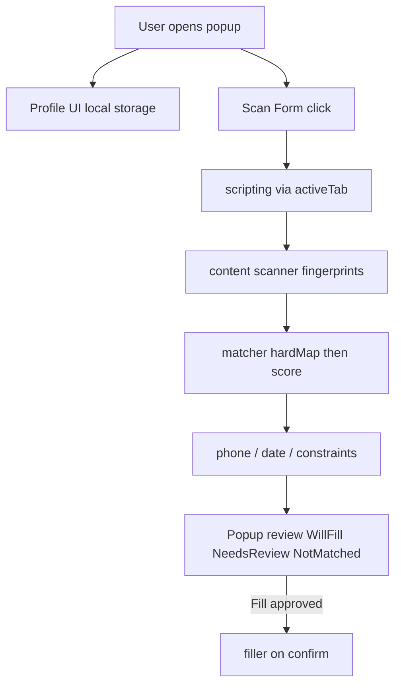

# FoxFill — Refined Architecture Plan

Source of truth for product rules, architecture, and roadmap.  
Philosophy: **Fill what I know. Show me what I don't.** Never guess when ambiguous.

## Locked product rules

- **Detection hierarchy:** `autocomplete` (hard map) → associated `<label>` → `aria-label` → `name`/`id` → `placeholder` → nearby text.
- **Autocomplete:** Standard tokens (`given-name`, `family-name`, `email`, `tel`, `street-address`, `honorific-prefix`, `bday`, etc.) are direct mappings; skip normal scoring unless a clear conflict exists.
- **Heuristic scoring:** Meet minimum threshold (high ≥80, medium ≥60); winner must beat runner-up by **≥20**; otherwise **Needs Review**.
- **Profile → fields:** Same profile value may fill multiple confidently matched fields (e.g. Email + Confirm Email). No fill for unrelated/ambiguous fields.
- **Foreign sections:** Emergency, bank, insurance, PAYE, employer, spouse, etc. must not receive personal profile data.
- **Filling:** Native value setter + bubbling `input` / `change` / `blur`. Never assume `el.value = …` alone. No auto-submit. No overwrite without approval. No passwords.
- **Permissions V1:** `storage`, `activeTab`, `scripting` only. No `<all_urls>`. No silent scanning — only after the user opens the popup and clicks Scan Form.
- **UI V1:** Popup only. No in-page overlay.
- **Non-goals V1:** No AI/APIs, no password-manager replacement, no sync/account/backend, no multi-browser.

## Architecture



### Project layout

```
FoxFill/
  manifest.json
  popup/           popup.html, popup.js, popup.css
  content/         scanner.js, matcher.js, compound.js, filler.js
  background/      service-worker.js
  data/            fieldPatterns.js, phoneParse.js, dateFormat.js, fitValue.js
  assets/icons/
  fixtures/        test-form.html
  PLAN.md          this document
  README.md
```

### Brand tokens

| Token   | Value     |
| ------- | --------- |
| Primary | `#0F3D2E` |
| Accent  | `#D4B574` |
| Surface | `#F8F7F4` |
| Text    | `#1F2A25` / `#6B7A72` |

Typography: Playfair Display for wordmark only; Inter for UI chrome.

### Language

Plain modular JavaScript (Manifest V3). No build step for V1.

## Profile fields

**Personal:** `title`, `firstName`, `lastName`, `idNumber`, `email`, `phone`, `dateOfBirth`  
**Address:** `residenceType`, `addressLine1`, `addressLine2`, `suburb`, `city`, `province`, `postalCode`, `country`

Profiles are named and stored locally (`foxfillStore`). Legacy single-profile data migrates automatically. Matcher owns international aliases (state/region, zip/postcode, neighborhood, etc.).

## Matching engine contract

1. Build field fingerprint (tag, type, id, name, placeholder, autocomplete, aria-label, label, nearby text, section heading, constraints, select options, static dial prefix).
2. Skip foreign-section fields and area-code-only boxes.
3. If valid autocomplete token → hard-map to profile field.
4. Else score candidate profile fields via weighted signals; classify:
   - **Will fill:** score ≥ 80 AND margin ≥ 20 vs second place
   - **Needs review:** medium score OR margin < 20
   - **Not matched:** below threshold
5. Allow one profile value → many fields when each field independently qualifies.
6. Heuristics for bare **Name** → `firstName`, personal **Date** → `dateOfBirth`, honorific / residence-type selects, etc.

## Phone & date behaviour

- Parse stored phone into full / dial / national parts (`phoneParse.js`).
- **Dial companion** (country-code `<select>`): fill dial option + national phone.
- **Static `+27` chrome** beside the input (not a separate control): fill **national only** — do not duplicate the country code.
- **Area code** boxes: left empty (not invented from the profile).
- Fit values to `maxlength` / `pattern` / masks (`fitValue.js`) before review and again on live fill.
- DOB stored as ISO; filled via `dateFormat.js` to match the field’s pattern.
- **Iframes:** Scan and fill run across all frames on the tab (needed for sites like Discovery quote flows).

## Phased roadmap

| Phase | Outcome | Status |
| ----- | ------- | ------ |
| **1 Foundation** | MV3, popup branding, Scan Form counts inputs | Done |
| **2 Scanner** | Full fingerprints; console inspection | Done |
| **3 Basic matching** | Name/email/phone/address aliases + profile | Done |
| **4 Scoring** | Weighted confidence + 20-pt margin + autocomplete hard maps | Done |
| **5 Safe filling** | Native setter + events; no overwrite; never submit | Done |
| **5b Phone compounds** | Dial companions, national vs full, static `+CC` prefix | Done |
| **6 Review UI** | Will fill / Needs review / Not matched + Fill N Fields | Done |
| **6+ Profile extras** | Title, ID number, residence type, constraint-aware phone/DOB | Done |
| **7 Polish** | Empty states, errors, motion, clearer review values | Done |
| **8 Multi-profile** | Named local profiles (switch / new / rename / delete) | Done |
| **8b Later** | Encryption at rest, custom fields, optional overlay | Later |

## Out of scope (until later)

Broad host permissions, AI matching, overlay UI, sync/accounts, auto-submit, password fields, multi-browser packaging.
